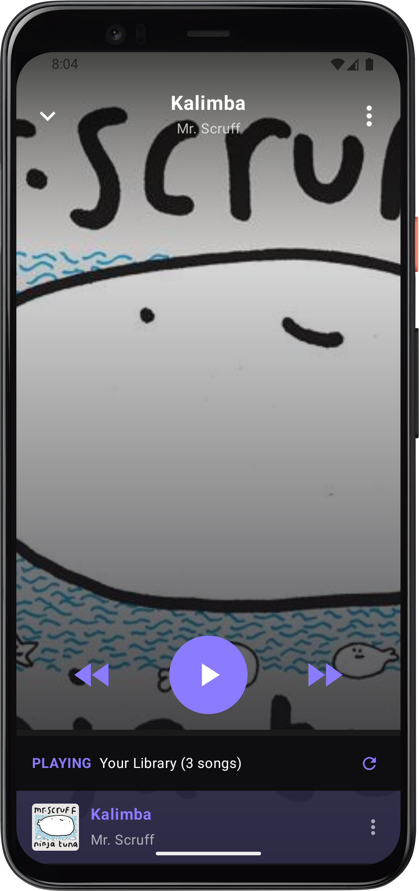

  

<h1 align="center">Shozan Music Player</h1>

  a simple music player inspired by Shazam’s player UI.
   
  <strong>Under Development; literally only plays mp3s and flacs</strong>

  

---

## .about

this project is a lightweight music player that focuses on a clean, minimal, and modern design inspired by Shazam’s music player interface.  
currently, it supports **playing songs only** and is still in super early alpha alpha development.

---

## .features

- Shazam-inspired UI
- play songs (local files only)
- controls work
- minimal design
- lightweight and fast (i hope)

---

## .under construction

this project is still a big WIP. some features may be incomplete or unstable.

to-do:
- playlists & song queue
- shuffle & repeat modes
- actual library

---

## .built with

  - Java
  - Kotlin

---

## .Installation

1) Download the APK
2) Install it as a normal file
3) Done

